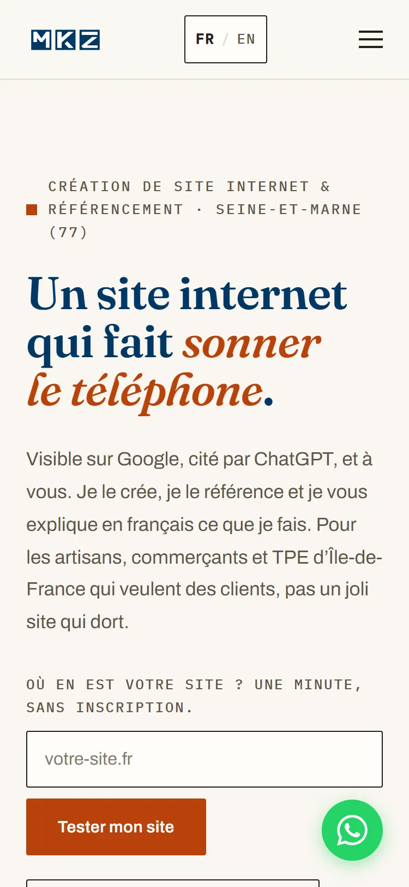

<p align="center">
  <picture>
    <source media="(prefers-color-scheme: dark)" srcset="public/images/mkz-logo-footer.svg">
    
  </picture>
</p>

<h1 align="center">mkz-consulting.fr</h1>

<p align="center">
  <strong>Le code source du site de MKZ Consulting : création de sites internet, SEO et référencement IA pour les artisans, commerçants et TPE.</strong><br>
  Un site statique construit pour être trouvé sur Google <em>et</em> cité par ChatGPT, Perplexity ou Gemini. Chaque chiffre technique de ce dépôt est mesuré et daté.
</p>

<p align="center">
  <a href="https://mkz-consulting.fr">Site</a> ·
  <a href="https://mkz-consulting.fr/outils/">Outils gratuits</a> ·
  <a href="https://mkz-consulting.fr/conseils/">Conseils</a> ·
  <a href="https://mkz-consulting.fr/tarifs/">Tarifs</a> ·
  <a href="https://mkz-consulting.fr/contact/">Contact</a> ·
  <a href="https://mkz-consulting.fr/en/">English site</a>
</p>

<p align="center">
  <a href="https://mkz-consulting.fr"></a>
  <a href="https://github.com/mkz-web/mkz-site/commits/master"></a>
  
  
  
  
</p>

<p align="center"><sub>Ce README est en français. <a href="#in-english">English summary at the end.</a></sub></p>

<p align="center">
  
  
</p>
<p align="center"><sub>Accueil en production, capturé le 09/09/2026 à 1 280 px et à 375 px, bandeau de consentement refusé avant le chargement.</sub></p>

## Ce que ce dépôt contient

- ✅ **Un site bilingue en export statique.** 54 pages au sitemap (38 en français, 16 en anglais). Le français reste à la racine des URL, l'anglais vit sous `/en/`, et les `hreflang` réciproques sont générés depuis une seule liste de paires.
- ✅ **Une newsroom en cocons sémantiques.** 19 articles français répartis en 4 cocons (tutoriels, création de site, SEO, référencement IA) et 3 articles anglais en 2 cocons. Chaque cocon pousse vers sa page pilier.
- ✅ **Deux outils gratuits, sans inscription.** L'[audit SEO + IA](https://mkz-consulting.fr/audit-seo/) : 20 mesures en une minute, score sur 100, moteur exécuté en Cloudflare Pages Functions. Le [simulateur d'empreinte d'une requête IA](https://mkz-consulting.fr/empreinte-ia/) : énergie, CO2 et eau d'une question posée à un modèle, jeu de données versionné.
- ✅ **Le socle GEO.** `llms.txt` et `llms-full.txt` générés au build depuis le registre d'articles, JSON-LD reparsé par script avant chaque déploiement, `robots.txt` ouvert aux robots des IA, barre « Résumer avec l'IA » sur chaque article.
- ✅ **La vie privée par construction.** Bandeau de consentement maison, Google Analytics 4 et Microsoft Clarity chargés uniquement après accord, zéro ressource externe dans le HTML statique.
- ✅ **12 scripts Node sans dépendance.** Ingestion des articles, validation du build, déploiement, captures d'écran, harnais de test du moteur d'audit.
- ✅ **Le journal des décisions.** [AGENTS.md](AGENTS.md) consigne chaque choix, chaque mesure et chaque piège payé, avec sa date. C'est le premier fichier à lire avant de toucher au code.

## Démarrer en trois commandes

```bash
git clone https://github.com/mkz-web/mkz-site.git && cd mkz-site
npm ci
npm run dev
```

Puis, avant tout déploiement, construire et valider le site statique :

```bash
npm run build
node scripts/validate-out.mjs
```

Prérequis : Node 20.9 ou plus récent (exigence de Next 16) et Git. Aucun compte ni aucune clé n'est nécessaire pour développer et construire le site. Seul l'outil d'audit demande un peu plus pour tourner en local : `npx wrangler pages dev out --port 8788` sert le build avec ses fonctions, et un fichier `.dev.vars` (ignoré par git) porte les identifiants DataForSEO du bloc « autorité ». Sans eux, ces quatre mesures s'affichent « non mesuré » et le reste du scan fonctionne.

## Pourquoi c'est construit comme ça

Sept décisions structurent le dépôt. Chacune est argumentée en détail dans [AGENTS.md](AGENTS.md).

| Décision | Pourquoi | Où c'est écrit |
|---|---|---|
| Export statique, pas de serveur applicatif | Une page HTML par URL, servie par un CDN : rapide, sans coût de serveur, sans surface d'attaque applicative. La seule logique serveur, l'API du scan, vit dans une Pages Function. | `next.config.ts`, `functions/api/` |
| Deux root layouts `(fr)` et `(en)` au lieu du gabarit `[lang]` | Seul moyen d'obtenir deux attributs `lang` réels en export statique sans déplacer les URL françaises déjà indexées. | `src/app/`, AGENTS.md « Site bilingue » |
| L'anglais n'est jamais une traduction du français | Les deux versions répondent à des demandes différentes, mesurées séparément. Une page dont l'intention n'existe pas en anglais n'est pas créée, et le fichier de contenu dit pourquoi. | `src/content/en/pillars/website-design.ts` |
| « Référencement IA » plutôt que GEO, LLMO ou AEO en français | Volumes France mesurés sur deux semestres : « référencement ia » en hausse de 50 %, « llmo » en baisse de 62 %. Le terme de tête est celui que les gens tapent. | AGENTS.md « Cocon référencement IA » |
| Polices auto-hébergées avec replis aux métriques calées | Le décalage de mise en page (CLS) de l'accueil mobile est passé de 0,1412 à 0,0012. | `src/lib/GlobalStyles.tsx` |
| Bandeau de consentement écrit maison | Le bandeau tiers occupait 67 % de l'écran mobile et rangeait la mesure d'audience sous « Pub personnalisée ». Le nôtre : deux boutons de même taille, refus aussi simple que l'accord, rien dans le HTML statique. | `src/components/ConsentBanner.tsx`, `src/lib/consent.ts` |
| Un chiffre technique est une mesure, jamais une déduction | « Pas de JSON-LD » n'est pas « pas cité par les IA ». On mesure l'effet, avec sa date, ou on écrit « non mesuré ». | `scripts/validate-out.mjs`, `scripts/test-audit-engine.mjs` |

## Ce qui est mesuré

Tous les relevés ci-dessous sont reproductibles avec les scripts du dépôt ou les outils cités. Ce qui n'a pas été mesuré n'y figure pas.

| Invariant | Relevé | Date | Méthode |
|---|---|---|---|
| Décalage de mise en page (CLS) de l'accueil, mobile | 0,0012 | 08/08/2026 | Chrome 151, chargements froids, avant et après calage des replis de polices |
| Lighthouse, catégorie « Agentic Browsing », accueil | 1,00 | 15/08/2026 | Chrome 151, mobile |
| Accès réel des robots IA | 180 requêtes, 180 réponses 200, aucun `X-Robots-Tag` | 15/08/2026 | 20 user-agents (GPTBot, ClaudeBot, PerplexityBot, Googlebot...) sur 9 URL |
| Couverture d'exploration | 45 URL au sitemap, 45 atteignables depuis l'accueil, 0 orpheline, 0 lien cassé | 15/08/2026 | croisement sitemap, liens, `llms.txt` |
| Débordement horizontal à 375 px | 0 px sur les gabarits contrôlés | 21/08/2026 | mesure au DOM, avant et après scan sur la page outil |
| Ressources externes dans le HTML statique | 0 | 21/08/2026 | inventaire du build après retrait du bandeau tiers |
| Score de l'outil d'audit sur ce site | 89 / 100, 0 mesure non mesurée | 03/09/2026 | `node scripts/test-audit-engine.mjs --attendu-mkz` |
| Pages publiées | 54 au sitemap (38 FR, 16 EN) | 04/09/2026 | build |

## Structure du dépôt

```text
src/app/(fr)/           pages françaises, à la racine des URL
src/app/(en)/en/        pages anglaises
src/app/llms*.txt/      llms.txt et llms-full.txt, générés au build
src/components/         gabarits : Header, Footer, PillarContent, ArticleRenderer, audit/, conseils/
src/content/            articles et piliers français ; en/ pour l'anglais
src/lib/i18n.ts         dictionnaire d'interface et liste des paires hreflang
functions/api/          /api/scan : moteur de l'outil d'audit (Cloudflare Pages Functions)
empreinte-ia/           simulateur d'empreinte, sous-projet sans dépendance, construit vers public/empreinte-ia/
public/                 _headers (CSP, HSTS), robots.txt, polices, images
scripts/                12 scripts Node sans dépendance (tableau ci-dessous)
AGENTS.md               journal des décisions, des mesures et des pièges
```

Les dossiers `_content-staging/`, `_research/` et `_backlinks/` sont ignorés par git : matière de travail éditoriale, pas du site.

## Scripts

Tous en Node natif, sans rien installer. Chaque script porte en tête sa commande, son runtime minimal et « Dépendances : aucune ».

| Script | Rôle |
|---|---|
| `ingest-content.mjs` | Transforme les articles du staging JSON en fichiers TypeScript typés et régénère le registre |
| `validate-out.mjs` | Reparse tous les JSON-LD du build, contrôle titles et metas, hreflang réciproques, maillage interne |
| `deploy.mjs` | Publie `out/` et `functions/` sur Cloudflare Pages par upload direct (wrangler via npx) |
| `test-audit-engine.mjs` | Harnais de vérité terrain du moteur d'audit ; `--attendu-mkz` compare au résultat attendu sur ce site |
| `capturer-apercu-scan.mjs` | Capture réelle du résultat du scan pour les cartes des accueils et des hubs outils |
| `capturer-accueil-readme.mjs` | Capture réelle de l'accueil en production pour ce README, bandeau de consentement refusé, contrôles avant capture |
| `convertir-captures.mjs` | Convertit des captures PNG en WebP avec le canvas de Chrome en headless |
| `verify-coordonnees.mjs` | Vérifie qu'un crawler sans JavaScript lit bien les coordonnées légales |
| `ga4-admin.mjs` | Administration GA4 par l'API Admin : événements clés, mesure avancée |
| `download-fonts.mjs` | Récupère les polices en woff2 auto-hébergés |
| `generate-favicon.mjs` | Génère le favicon depuis l'artwork source, zlib natif uniquement |
| `generate-og-image.mjs` | Génère l'image OpenGraph 1200 × 630 |

Le sous-projet `empreinte-ia/` a ses propres commandes : `npm run build:empreinte` et `npm run test:empreinte` (tests golden du moteur de calcul).

## Déploiement

Hébergement Cloudflare Pages, projet `mkz-site`, production sur `https://mkz-consulting.fr`. Le sous-domaine technique `mkz-site.pages.dev` est fermé par Cloudflare Access et en `noindex` : ce n'est pas une adresse publique.

```bash
npm run deploy:build   # build puis publication
npm run deploy         # publication d'un out/ déjà construit
```

Variables d'environnement attendues : `CLOUDFLARE_API_TOKEN_MKZ` (repli sur `CLOUDFLARE_API_TOKEN`) et `CLOUDFLARE_ACCOUNT_ID`. Les identifiants DataForSEO de l'outil d'audit sont des secrets du projet Pages, jamais des fichiers du dépôt. Un secret ou un binding ajouté après coup n'atteint le site qu'à la republication suivante.

Après chaque déploiement, trois contrôles : `llms.txt`, `llms-full.txt`, `sitemap.xml` et `robots.txt` servis identiques au build ; un `POST /api/scan` en phase `origin` qui répond 200 ; le sitemap resoumis dans la Search Console.

## Contribuer, signaler

Le dépôt est public pour montrer comment le site est fait. Les [issues](https://github.com/mkz-web/mkz-site/issues) sont ouvertes : coquille, lien cassé, défaut d'affichage sur un appareil, chiffre qui a vieilli. Une pull request de correction est la bienvenue si elle respecte trois règles :

1. **Tout contenu existe en français et en anglais**, et l'anglais n'est pas une traduction. Une page dans une seule langue est un travail inachevé.
2. **Un chiffre technique est une mesure datée**, jamais une estimation. S'il ne peut pas être mesuré, on écrit « non mesuré ».
3. **`node scripts/validate-out.mjs` passe** sur le build avant toute demande de fusion.

Les articles ne s'éditent pas directement dans `src/content/articles/` : ils y sont générés depuis le staging, et l'ingestion suivante écraserait la modification.

## À propos

**MKZ**, SAS à associé unique, SIRET 983 662 784 00013, RCS Meaux. 1 rue Françoise Sagan, 77230 Dammartin-en-Goële. Fondée par [Mickaël Leclerc](https://mkz-consulting.fr/about/), ingénieur IT depuis plus de vingt ans (infrastructure, automatisation, DevOps), consultant SEO et référencement IA en Seine-et-Marne.

Contact : [contact@mkz-consulting.fr](mailto:contact@mkz-consulting.fr) · 07 69 09 39 09 · [Réserver 30 minutes d'audit gratuit](https://calendly.com/mkz-consulting/30min)

## Licence

Pas de licence open source. Le code, les contenus, la marque et les visuels restent la propriété de MKZ : tous droits réservés. Le dépôt est lisible pour la transparence et l'inspiration ; il n'est pas réutilisable tel quel.

## In English

This is the source code of [mkz-consulting.fr](https://mkz-consulting.fr/en/), the website of MKZ Consulting, a French agency helping tradespeople, shop owners and small businesses get found on Google and cited by AI answer engines. The site is a bilingual static export built with Next.js 16, hosted on Cloudflare Pages: 54 pages (38 French, 16 English), a newsroom organised in topic clusters, two free tools (a 20-check [SEO + AI audit](https://mkz-consulting.fr/en/seo-audit/) running on Pages Functions, and an AI query footprint simulator), generated `llms.txt` files, script-validated JSON-LD, and a home-made consent banner that loads analytics only after opt-in.

The English pages are never translations: each one targets a demand measured separately, mainly foreign companies that need the French market to work for them. Every technical figure in this README was measured on a stated date; anything unmeasured is left out. Decisions, pitfalls and measurements are logged in [AGENTS.md](AGENTS.md) (in French). Quick start: `npm ci`, `npm run dev`, then `npm run build` and `node scripts/validate-out.mjs` before deploying. No open source licence: all rights reserved.
